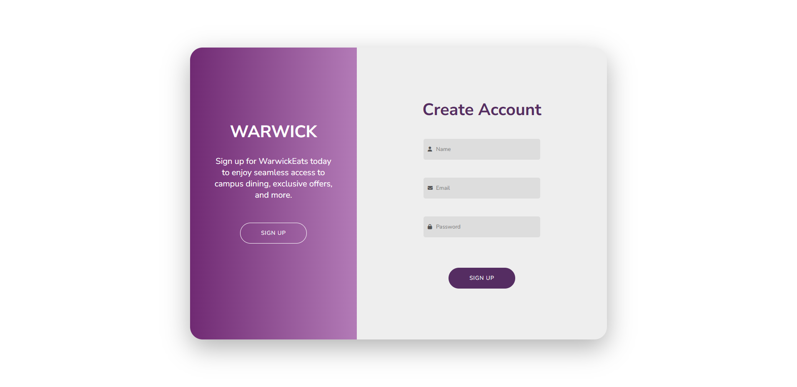

# Sign-Up Form Example

This repository contains a simple sign-up form built with HTML, CSS, and JS. The form includes various input fields, along with a simple layout and a call-to-action button.

## Preview

## Live Demo
Check out the live version of the sign-up form here:
[Sign-Up Form Live Demo](https://jordan-bruno.github.io/signup-form-html-css-js-example/)

## License
This project is licensed under the [MIT License](LICENSE).
